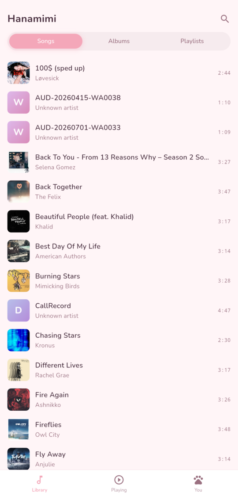
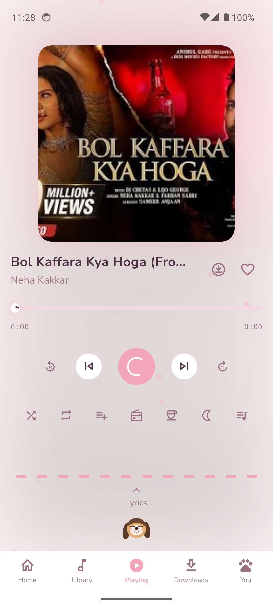
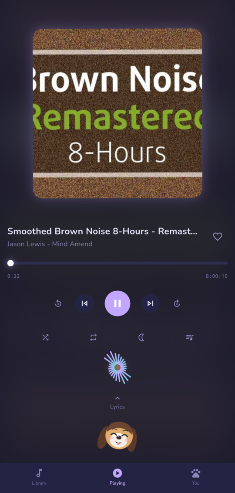
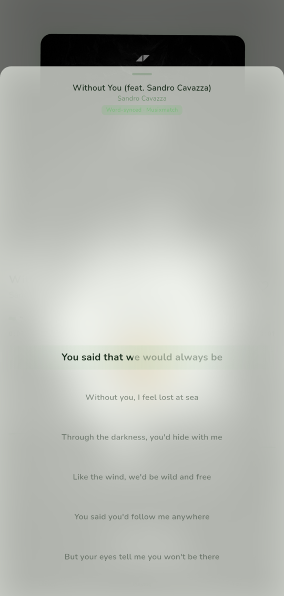
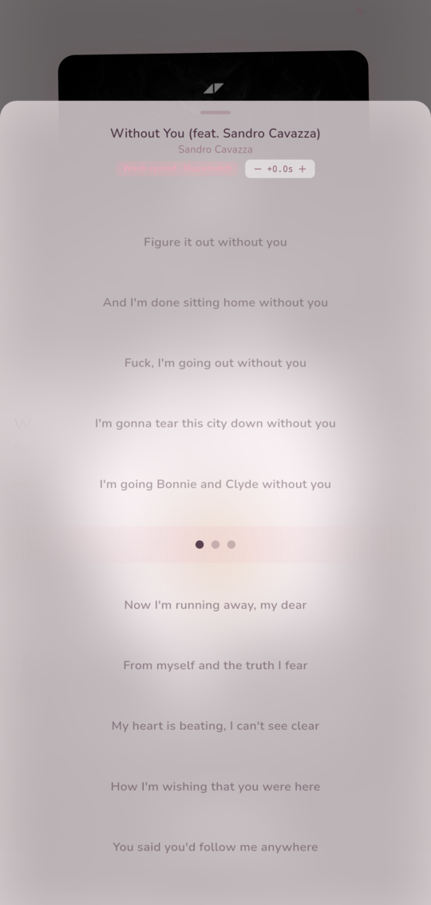
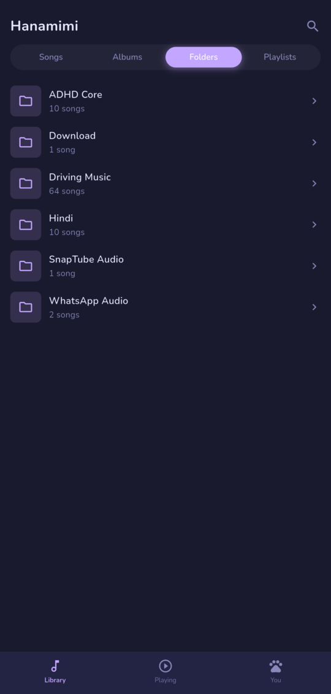
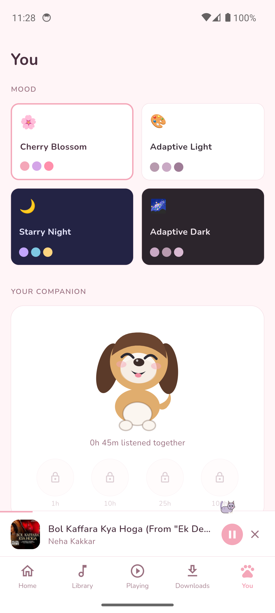
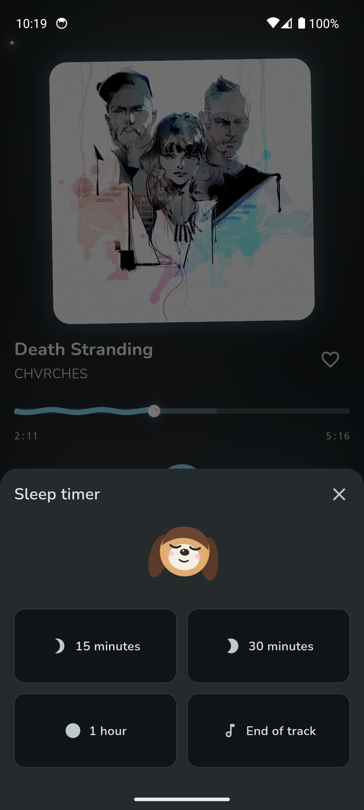

# Hanamimi 花耳

> A kawaii, offline-first music player for Android with a beagle mascot that vibes to your music.
> Built with Flutter. Named after a real dog. 🐶

Hanamimi plays the music already on your phone — no accounts, no streaming, no ads — and wraps it in a soft, living interface: four mood themes, a real FFT visualizer, word-synced karaoke lyrics, and a little beagle who bops her head to the beat.

## Screenshots

| Library | Now Playing | Starry Night |
|:---:|:---:|:---:|
|  |  |  |

| Karaoke lyrics | Instrumental breaks | Folders | You | Sleep timer |
|:---:|:---:|:---:|:---:|:---:|
|  |  |  |  |  |

## Features

**Player**
- Local playback via MediaStore scan — songs, albums, **folders** (VLC-style directory browsing), playlists
- Background audio with lock-screen / notification controls and media buttons
- True two-player **crossfade** (2–12 s, smoothstep ramp), shuffle / repeat / repeat-one
- Queue sheet with tap-to-jump, swipe a track right to queue it, left to add to a playlist
- Playlists with pastel covers: play all, swipe-left to remove a song, delete with confirm
- Library-wide search across songs, albums, folders and playlists
- **Excluded folders** — hide any directory from the scan (You → More → Excluded folders)
- Registers as an audio handler — "open with Hanamimi" works from file managers and other apps
- Sleep timer with moon-phase presets: countdown or end-of-track, 30 s volume fade with screen dimming

**Lyrics (the fun part)**
- **Word-by-word karaoke highlighting** in the style of [beautiful-lyrics](https://github.com/surfbryce/beautiful-lyrics) — per-word glow, scale and lift, feathered fill edge, smooth centered scrolling
- Three sources with quality priority (**word-synced > line-synced > plain**):
  1. Lyrics embedded in the audio file itself (ID3 `USLT`/`TXXX`, FLAC comments — enhanced LRC word tags supported)
  2. Musixmatch richsync (true word timings)
  3. [LRCLIB](https://lrclib.net) (line-synced)
- Filling dot indicators during intros and instrumental breaks
- Tap any line to seek there; per-track sync offset (±0.5 s nudges) for files that are a different master than the timing source
- Source picker on the quality badge — force embedded / Musixmatch / LRCLIB per track; sources are probed on open, and ones with nothing for the song are greyed out

**Visualizer & mascot**
- Real FFT computed from the decoded audio itself (60 fps, 12 log-spaced bands, per-track disk cache, **no microphone permission**), styled per theme: pastel bars, falling raindrops, radial starburst, waveform — with a sensitivity control for quiet songs
- Hanamimi the beagle is drawn and animated entirely in code (`CustomPainter`): blink scheduler, amplitude-driven head bop with lagging-ear physics, head-tilt on track change, snoring with floating z's
- Accessories unlocked by listen time (bow → headphones → flower → crown)

**Design**
- Four themes: Cherry Blossom 🌸, Rainy Day 🌧️, Starry Night 🌙, Matcha 🍵
- Sakura petals / drifting stars, caterpillar seek bar with eyes, heart-burst likes
- Nunito everywhere, nothing has a hard corner, reduce-motion aware
- A couple of easter eggs — try tapping the mascot a few times 🐱

## Building

Requirements: Flutter 3.29+, Android SDK (minSdk 24), a device or emulator.

```bash
# debug
flutter pub get
flutter run

# signed release → install → launch (expects android/key.properties + keystore)
./build-hanamimi.sh

# reinstall the last release build without rebuilding
./build-hanamimi.sh --install
```

Release signing reads `android/key.properties` (gitignored):

```properties
storePassword=…
keyPassword=…
keyAlias=…
storeFile=../keystore/your-release.jks
```

The launcher icon is rendered from the mascot painter itself:
`flutter test test/tools/generate_icon_test.dart && dart run flutter_launcher_icons`.

## Architecture

```
lib/
├── audio/        QueueManager (two-player crossfade), audio_service handler, sleep timer
├── library/      sqflite repository, Kotlin MediaStore scanner channel
├── lyrics/       LRC + enhanced-LRC parser, richsync parser, embedded-tag readers,
│                 Musixmatch/LRCLIB providers, quality-priority resolution
├── visualizer/   FFT band processor + per-theme painters
├── providers/    Riverpod state (audio, library, lyrics, theme, mascot, …)
├── theme/        design tokens + the four HanamimiTheme palettes
└── ui/           screens, mascot painter/animator, lyrics sheet, modals

android/…/app/    MainActivity + MediaStoreChannel.kt + FftExtractorChannel.kt
```

## Notes

- **Android only** (v1). The visualizer decodes each track itself (`MediaExtractor`/`MediaCodec` → FFT at 60 fps, disk-cached per track) — **no microphone / RECORD_AUDIO permission**, and it stays accurate regardless of the output mix.
- Musixmatch is accessed through its unofficial desktop-app API, best-effort with graceful fallback — intended for personal use.
- Word timings come keyed to specific releases; local files that are a different master can drift, which is what the per-track sync offset is for.

## Credits

- [beautiful-lyrics](https://github.com/surfbryce/beautiful-lyrics) and [spicy-lyrics](https://github.com/Spikerko/spicy-lyrics) — the karaoke animation language this app's lyrics view is modeled on
- [LRCLIB](https://lrclib.net) — free, keyless synced lyrics
- Hanamimi — the real beagle 🐾
