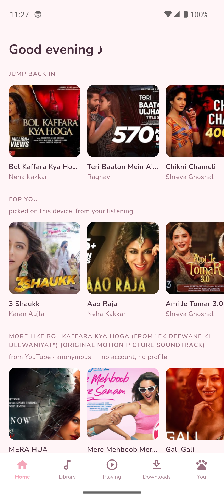
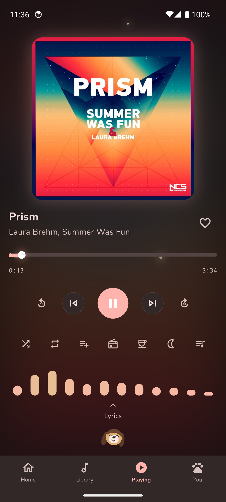
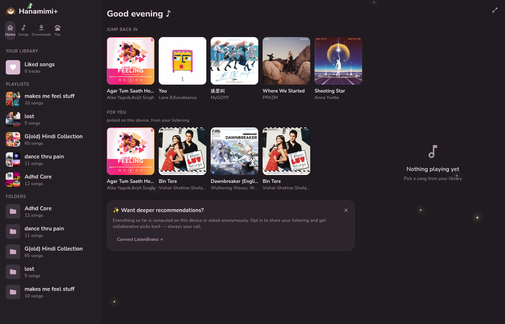
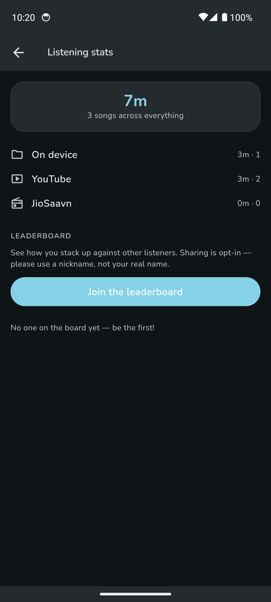

# Hanamimi+ 花耳

> A kawaii music player with a beagle mascot that vibes to your music — offline-first, now with online streaming, desktop apps, and on-device recommendations.
> Built with Flutter. Named after a real dog. 🐶

Hanamimi plays the music already on your device and, on **Hanamimi+**, streams from YouTube and JioSaavn too — wrapped in a soft, living interface: mood themes, a real FFT visualizer, word-synced karaoke lyrics, a Home page that learns what you like, and a little beagle who bops her head to the beat.

> **Two editions.** **Hanamimi** (the `main` branch) is the Play-Store-safe base: your own music, fully local, no network. **Hanamimi+** (this `plus` branch) adds online streaming, downloads, playlist import, desktop apps, and the online recommendation tiers. They install side by side. See [docs/EDITIONS.md](docs/EDITIONS.md).

## Screenshots

| Home (recommendations) | Now Playing | Adaptive theme |
|:---:|:---:|:---:|
|  |  |  |

| Desktop (Linux/Windows) |
|:---:|
|  |

| Karaoke lyrics | Listening stats | Library | You | Sleep timer |
|:---:|:---:|:---:|:---:|:---:|
|  |  |  |  |  |

## Features

**Home & recommendations** *(new in 2.0)*
- A **Home** start page with shelves in trust order: **Jump back in** (recents), **For you** (on-device picks), and — on +, opt-in — online **Discover**
- Everything personal is computed **on the device**: recency-weighted plays, a co-play/Markov matrix ("after this, you usually play that"), a skip signal, and audio-feature similarity extracted for free during the visualizer decode
- **Song radio** (seed any track into a station), **smart shuffle** (weighted toward your favorites), and queue-end **autoplay** that keeps going with similar songs
- A **three-position privacy dial** — you choose how much leaves the device:
  1. **Local only** (default) — recommendations from your own library, airplane-mode safe
  2. **Anonymous discovery** (+; default-on) — locally-chosen seeds ask YouTube / JioSaavn for related tracks with no account
  3. **YT Music sign-in** (opt-in) — your real personalized feed via cookie login; **read-only by default**, so playback stays anonymous and nothing is added to your history unless you turn that on
- Each source stays in its own lane: a station from a YouTube track continues on YouTube, JioSaavn on JioSaavn, your own library on-device — the queue never becomes a hodgepodge

**Online (Hanamimi+)**
- Search **YouTube** (Innertube + bundled yt-dlp for full-speed audio) and **JioSaavn** (CBR streams) from the You tab — Library search stays local
- **Downloads** tab — save any online track for offline, with a per-track quality picker
- **Import a playlist** from a YouTube or Spotify link — fuzzy-matched into a new playlist
- Everything flows through the same one engine as local files: crossfade, visualizer, lyrics, notification, playlists
- **Listening stats** — minutes and songs per platform (on-device, YouTube, JioSaavn) plus a cumulative total, with an **opt-in global leaderboard** (nicknames only; sharing your device make/model is a separate choice)

**Desktop (Hanamimi+)**
- Native **Linux** and **Windows** apps (media_kit / libmpv — no Electron), packaged as **AppImage**, Windows **installer**, and **pacman** package
- **MPRIS** (Linux) / **SMTC** (Windows) now-playing + media keys; a Spotify-style three-pane shell on wide windows
- **oneko** — on desktop the cat buddy wakes up as the classic cursor-chasing cat and skitters across the whole window
- Adaptive shell: phones, unfolded foldables (rail + panel), and tablets (full sidebar) lay out by width

**Player**
- Local playback via MediaStore scan — songs, albums, **folders** (VLC-style directory browsing), playlists
- Background audio with lock-screen / notification controls and media buttons
- True two-player **crossfade** (2–12 s, smoothstep ramp), shuffle / repeat / repeat-one
- Queue sheet with tap-to-jump, swipe a track right to queue it, left to add to a playlist
- Playlists with pastel or custom covers: play all, reorder, swipe-left to remove, delete with confirm
- Library-wide search across songs, albums, folders and playlists; **excluded folders** to hide directories
- Registers as an audio handler — "open with Hanamimi" works from file managers and other apps
- Sleep timer with moon-phase presets; **caffeine** toggle to keep the screen awake
- **Controller + touch friendly** — finger/stylus drag-scroll and gamepad navigation for handhelds (Steam Deck, ROG Ally)

**Lyrics (the fun part)**
- **Word-by-word karaoke highlighting** in the style of [beautiful-lyrics](https://github.com/surfbryce/beautiful-lyrics) — per-word glow, scale and lift, feathered fill edge, smooth centered scrolling
- Three sources with quality priority (**word-synced > line-synced > plain**): embedded tags (ID3 `USLT`/`TXXX`, FLAC comments, enhanced LRC) → Musixmatch richsync → [LRCLIB](https://lrclib.net)
- Filling dot indicators during intros and instrumental breaks; tap a line to seek; per-track sync offset
- Share a lyric snippet as a card

**Visualizer & mascot**
- Real FFT computed from the decoded audio itself (60 fps, 12 log-spaced bands, per-track disk cache, **no microphone permission**), styled per theme — with a sensitivity control for quiet songs
- Hanamimi the beagle is drawn and animated entirely in code (`CustomPainter`): blink scheduler, amplitude-driven head bop with lagging-ear physics, head-tilt on track change, snoring z's
- A flock of optional **buddies**, each individually toggleable — parrot, cat, duck, fireflies (dark themes), and on + a rabbit — anchored to furniture around the UI
- Accessories unlocked by listen time (bow → headphones → flower → crown)

**Design**
- Four themes: **Cherry Blossom 🌸**, **Adaptive Light**, **Starry Night 🌙**, **Adaptive Dark** — the Adaptive palettes are drawn live from the current album art (Material You–style) and follow the art's brightness; first launch follows your system light/dark setting
- Sakura petals / drifting stars, caterpillar seek bar with eyes, heart-burst likes
- Nunito everywhere, nothing has a hard corner, reduce-motion aware

## Building

Requirements: Flutter 3.29+, Android SDK (minSdk 24). Desktop builds need the platform toolchain (Linux: GTK/CMake; Windows: VS Build Tools).

```bash
# debug (Android)
flutter pub get
flutter run

# desktop
flutter run -d linux      # or -d windows

# signed Android release → install → launch (expects android/key.properties + keystore)
./build-hanamimi.sh
```

Release signing reads `android/key.properties` (gitignored):

```properties
storePassword=…
keyPassword=…
keyAlias=…
storeFile=../keystore/your-release.jks
```

The launcher icon is rendered from the mascot painter itself:
`flutter test test/tools/generate_icon_test.dart && dart run flutter_launcher_icons`.

## Architecture

```
lib/
├── audio/        AudioPlayerPort (just_audio on Android, media_kit on desktop),
│                 QueueManager (two-player crossfade), audio_service handler, sleep timer
├── online/       YouTube (Innertube + yt-dlp) & JioSaavn providers, stream resolver,
│                 caching, downloads, playlist import
├── reco/         on-device engine (co-play, features, recommender, station), Discover,
│                 YT Music session
├── library/      sqflite repository, Kotlin MediaStore scanner channel
├── lyrics/       LRC + richsync parsers, embedded-tag readers, provider resolution
├── visualizer/   FFT band processor + per-theme painters
├── platform/     desktop channels (libmpv FFT, MPRIS/SMTC, yt-dlp), gamepad input
├── providers/    Riverpod state (audio, library, reco, theme, mascot, …)
├── theme/        design tokens + the HanamimiTheme palettes (incl. adaptive)
└── ui/           screens (Home, Library, Now Playing, Downloads, You), mascot, modals

android/…/app/    MainActivity + MediaStore/FFT/yt-dlp/updater/power channels
```

## Notes

- Online providers use **unofficial APIs** (YouTube Innertube, JioSaavn JSON) — fine for a sideloaded personal app, not Play-Store-able; that's why the online + desktop code lives on the `plus` branch and base Hanamimi stays clean.
- The visualizer decodes each track itself (→ FFT at 60 fps, disk-cached) — **no microphone / RECORD_AUDIO permission** — and it stays accurate regardless of the output mix.
- The YT Music tier uses cookie sign-in (like InnerTune/OuterTune), not an OAuth app; a burner/secondary Google account is recommended in the consent screen.

## Credits

- [beautiful-lyrics](https://github.com/surfbryce/beautiful-lyrics) and [spicy-lyrics](https://github.com/Spikerko/spicy-lyrics) — the karaoke animation language this app's lyrics view is modeled on
- [LRCLIB](https://lrclib.net) — free, keyless synced lyrics
- **oneko** — the pointer-chasing cat (the mouse on desktop, your taps on a phone), ported from [oneko.js](https://github.com/adryd325/oneko.js) by **adryd** (reviving the classic X11 `neko`); its sprite sheet is bundled with the app. Brought over as an in-app buddy after the [Vencord oneko plugin](https://vencord.dev/plugins/oneko) by **V**. Both are GPLv3.
- **Claude Fable & Opus** — the dream team on debugging duty, for helping bring this whole thing to life 🤝
- Hanamimi — the real beagle 🐾

## License

Hanamimi+ is free software, licensed under the [GNU General Public License v3](LICENSE). This build links yt-dlp (via youtubedl-android) and bundles **oneko** — both GPLv3 — so the app as a whole is distributed under GPLv3.
